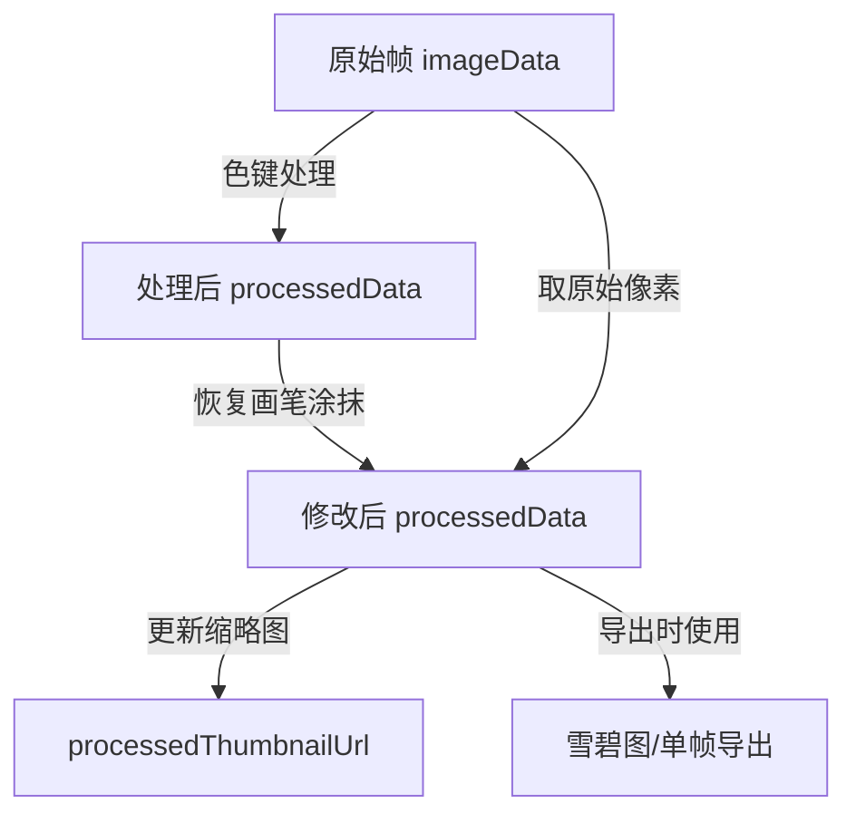
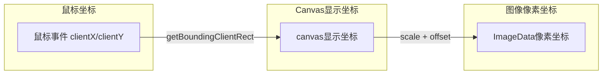
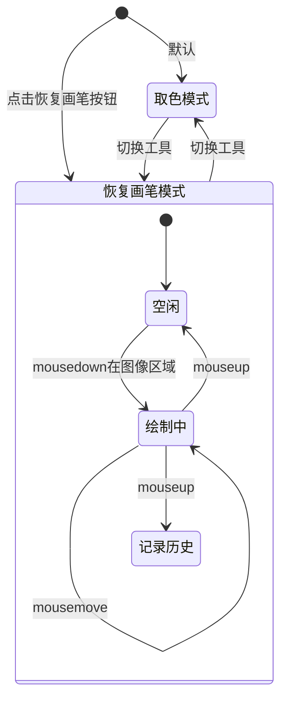
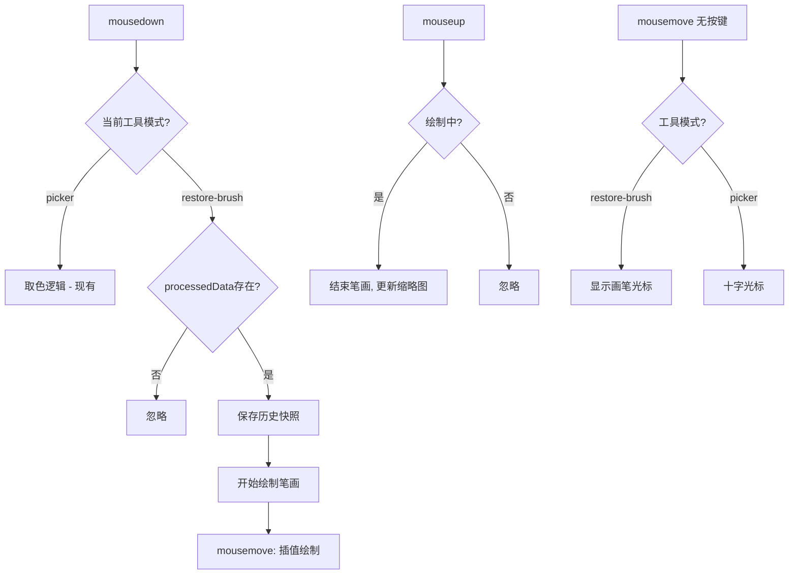
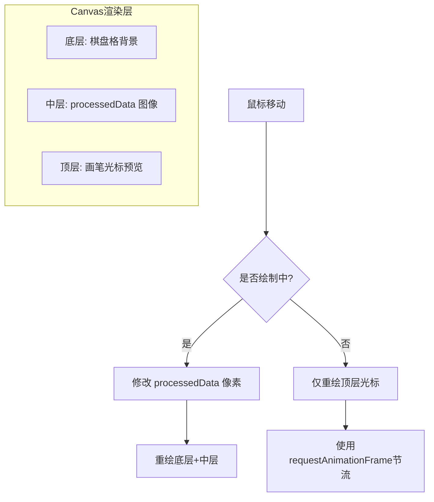

# PLAN-001: 背景移除 - 恢复画笔功能

> 状态：[ ] 待实施

## 一、需求分析

### 1.1 需求描述
在背景移除（色键处理）后，用户可通过「恢复画笔」手动涂抹已移除的区域，将原始像素恢复回来。适用于色键自动移除误伤前景像素时的精细修正。

### 1.2 核心场景
- 色键处理后，角色头发/边缘被误移除 → 用恢复画笔涂抹恢复
- 某些前景颜色与背景相近被误判 → 局部恢复
- 用户需要精细控制哪些区域保留/移除

### 1.3 前置条件
- 帧已执行过「应用到所有帧」（`processedData` 已存在）
- 用户选中了某一帧进行预览编辑

## 二、技术方案设计

### 2.1 数据流分析



### 2.2 坐标映射关系



Canvas 显示尺寸与 ImageData 实际尺寸的映射（参照 `previewFrame` 中的逻辑）：
- `scale = Math.min(canvas.width / img.width, canvas.height / img.height, 1)`
- `offsetX = (canvas.width - img.width * scale) / 2`
- `offsetY = (canvas.height - img.height * scale) / 2`
- 图像坐标 `imgX = (canvasX - offsetX) / scale`
- 图像坐标 `imgY = (canvasY - offsetY) / scale`

### 2.3 核心交互流程



## 三、详细实施步骤

### 3.1 类型定义扩展
**文件**: `src/types/index.ts`

- [x] 添加画笔工具类型枚举
- [x] 添加画笔配置接口

```typescript
/** 色键面板工具模式 */
export type ChromaKeyToolMode = 'picker' | 'restore-brush'

/** 画笔配置 */
export interface BrushConfig {
  size: number       // 画笔半径，单位：图像像素，默认 10
  hardness: number   // 硬度 0-100，控制边缘羽化程度，默认 80
}
```

### 3.2 创建画笔编辑 Composable
**新文件**: `src/composables/useBrushEdit.ts`

- [x] 管理画笔状态（工具模式、画笔大小、硬度）
- [x] 管理撤销/重做历史栈
- [x] 提供恢复画笔绘制方法
- [x] 提供画笔光标渲染方法

**核心方法设计**：

```
useBrushEdit() => {
  toolMode: Ref<ChromaKeyToolMode>
  brushConfig: Reactive<BrushConfig>
  historyStack: Ref<ImageData[]>
  historyIndex: Ref<number>

  // 切换工具模式
  setToolMode(mode: ChromaKeyToolMode): void

  // 恢复画笔绘制（在两点之间插值绘制，保证连续性）
  restoreStroke(
    frame: ExtractedFrame,
    fromImg: {x: number, y: number},
    toImg: {x: number, y: number}
  ): void

  // 保存当前状态到历史栈
  pushHistory(processedData: ImageData): void

  // 撤销
  undo(frame: ExtractedFrame): void

  // 重做
  redo(frame: ExtractedFrame): void

  // 画笔光标预览渲染
  renderBrushCursor(
    canvas: HTMLCanvasElement,
    canvasX: number,
    canvasY: number,
    scale: number
  ): void
}
```

**恢复画笔核心算法**：

```
function restoreStroke(frame, from, to):
  processedData = frame.processedData
  originalData = frame.imageData

  // Bresenham 直线插值：保证快速移动鼠标时笔画连续
  points = interpolateLine(from, to)

  for each point in points:
    // 遍历画笔覆盖的像素区域（圆形）
    for dx in range(-brushRadius, brushRadius):
      for dy in range(-brushRadius, brushRadius):
        dist = sqrt(dx*dx + dy*dy)
        if dist > brushRadius: continue

        imgX = point.x + dx
        imgY = point.y + dy
        if outOfBounds(imgX, imgY): continue

        idx = (imgY * width + imgX) * 4

        // 根据硬度计算混合权重
        if hardness < 100:
          edgeDist = dist / brushRadius
          featherZone = 1 - hardness / 100
          if edgeDist > featherZone:
            alpha = 1 - (edgeDist - featherZone) / (1 - featherZone)
          else:
            alpha = 1.0
        else:
          alpha = 1.0

        // 从原始图像恢复像素
        processedData.data[idx]   = originalData.data[idx]     // R
        processedData.data[idx+1] = originalData.data[idx+1]   // G
        processedData.data[idx+2] = originalData.data[idx+2]   // B
        processedData.data[idx+3] = Math.max(
          processedData.data[idx+3],
          Math.round(originalData.data[idx+3] * alpha)
        )

  // 更新缩略图
  frame.processedThumbnailUrl = generateThumbnail(processedData)
```

### 3.3 修改 ChromaKeyPanel 组件
**文件**: `src/components/chromakey/ChromaKeyPanel.vue`

- [x] 添加工具模式切换 UI（取色器 / 恢复画笔）
- [x] 添加画笔大小滑块
- [x] 添加画笔硬度滑块
- [x] 添加撤销/重做按钮
- [x] 修改 Canvas 鼠标事件处理（根据工具模式分发）
- [x] 实现恢复画笔的鼠标交互（mousedown/mousemove/mouseup）
- [x] 实现画笔光标预览（半透明圆形跟随鼠标）
- [x] 仅在 `processedData` 存在时启用恢复画笔

**UI 布局变更**：

```
┌─────────────────────────────┐
│ 目标颜色                     │  ← 现有
│ [颜色选择器]                 │
│                              │
│ ── 工具切换 ──               │  ← 新增
│ [🎨 取色] [🖌️ 恢复画笔]     │
│                              │
│ ── 画笔设置 (仅恢复模式) ──  │  ← 新增
│ 大小: ████████░░ 10px        │
│ 硬度: ██████████░ 80%        │
│ [↩ 撤销] [↪ 重做]           │
│                              │
│ 容差: ████████░░ 40          │  ← 现有
│ 边缘平滑度: ██░░░░░░░ 0     │  ← 现有
│                              │
│ [预览 Canvas 640x360]        │  ← 现有，增加画笔交互
│                              │
│ [应用到所有帧]               │  ← 现有
└─────────────────────────────┘
```

**Canvas 鼠标事件修改**：



### 3.4 修改 AppLayout 组件
**文件**: `src/components/layout/AppLayout.vue`

- [x] 引入 `useBrushEdit` composable
- [x] 将画笔相关状态通过 props 传递给 ChromaKeyPanel
- [x] 处理画笔相关事件

### 3.5 Canvas 重绘策略

绘制恢复画笔时不能每次 mousemove 都完整重绘 Canvas（性能问题）。采用分层策略：



为避免频繁重绘，采用：
- 绘制中：每次 `mousemove` 直接修改 `processedData` 的像素数据，然后重绘 Canvas
- 光标跟随：用 `requestAnimationFrame` 节流重绘

**优化方案**：使用离屏 Canvas 缓存处理后的图像，画笔绘制只更新脏区域。

### 3.6 撤销/重做实现

```typescript
// 历史栈设计
const historyStack = ref<ImageData[]>([])
const historyIndex = ref(-1)
const MAX_HISTORY = 30

function pushHistory(data: ImageData): void {
  // 截断当前位置之后的历史
  historyStack.value = historyStack.value.slice(0, historyIndex.value + 1)
  // 深拷贝当前 processedData
  const snapshot = new ImageData(
    new Uint8ClampedArray(data.data),
    data.width,
    data.height
  )
  historyStack.value.push(snapshot)
  if (historyStack.value.length > MAX_HISTORY) {
    historyStack.value.shift()
  }
  historyIndex.value = historyStack.value.length - 1
}
```

## 四、文件变更清单

| 文件 | 操作 | 变更内容 |
|------|------|----------|
| `src/types/index.ts` | 修改 | 新增 `ChromaKeyToolMode`、`BrushConfig` 类型 |
| `src/composables/useBrushEdit.ts` | **新增** | 画笔编辑 composable（状态管理、绘制算法、历史栈） |
| `src/components/chromakey/ChromaKeyPanel.vue` | 修改 | 工具切换UI、画笔交互、画笔参数控制、撤销重做 |
| `src/components/layout/AppLayout.vue` | 修改 | 集成 useBrushEdit、传递画笔状态到 ChromaKeyPanel |

## 五、潜在风险及应对

### 5.1 性能风险
- **风险**：大尺寸图像（1080p）上画笔连续绘制时频繁重绘 Canvas 可能卡顿
- **应对**：
  1. 使用 `requestAnimationFrame` 节流重绘频率
  2. 仅重绘画笔覆盖的脏区域而非整个 Canvas
  3. 历史快照使用 `Uint8ClampedArray` 深拷贝，限制最大 30 步

### 5.2 内存风险
- **风险**：每帧 processedData 的历史快照占用大量内存
- **应对**：
  1. 限制最大 30 步历史
  2. 切换帧时清空历史栈
  3. 使用 `structuredClone` 或手动 `new Uint8ClampedArray` 进行高效拷贝

### 5.3 坐标映射精度
- **风险**：Canvas 显示尺寸与 ImageData 尺寸不一致时，画笔位置偏移
- **应对**：复用 `previewFrame` 中已验证的缩放+偏移计算逻辑，封装为公共方法

### 5.4 兼容性
- **风险**：恢复画笔修改的是单帧 `processedData`，不影响其他帧
- **应对**：明确 UI 提示"恢复画笔仅影响当前选中帧"

## 六、测试策略

### 6.1 功能测试
- [ ] 色键处理后，选中已处理帧 → 恢复画笔可用
- [ ] 色键处理前或未选中帧 → 恢复画笔不可用（按钮 disabled）
- [ ] 使用恢复画笔涂抹已移除区域 → 像素恢复为原始颜色
- [ ] 调整画笔大小 → 涂抹范围正确变化
- [ ] 调整画笔硬度 → 边缘羽化效果正确
- [ ] 撤销/重做 → 正确回退/前进
- [ ] 快速移动鼠标 → 笔画连续无断裂（Bresenham 插值）

### 6.2 边界测试
- [ ] 在图像边缘涂抹 → 不越界
- [ ] 画笔大小设为 1 → 单像素精确恢复
- [ ] 画笔大小设为最大值 → 大面积恢复
- [ ] 连续撤销到初始状态 → 不崩溃
- [ ] 撤销后继续绘制 → 重做历史正确截断

### 6.3 交互测试
- [ ] 工具模式切换 → Canvas 光标正确变化（crosshair / 自定义圆形）
- [ ] 画笔光标跟随鼠标 → 位置准确、大小匹配画笔设置
- [ ] 切换选中帧 → 画笔状态正确重置
- [ ] 重新应用色键 → 画笔修改被覆盖（符合预期）

## 七、实施优先级

1. **P0（核心）**: 类型定义 + useBrushEdit composable + 恢复画笔绘制算法
2. **P0（核心）**: ChromaKeyPanel 工具模式切换 + 画笔鼠标交互
3. **P1（重要）**: 撤销/重做功能
4. **P2（体验）**: 画笔硬度控制
5. **P2（体验）**: 画笔光标预览渲染
6. **P3（优化）**: 脏区域重绘优化
